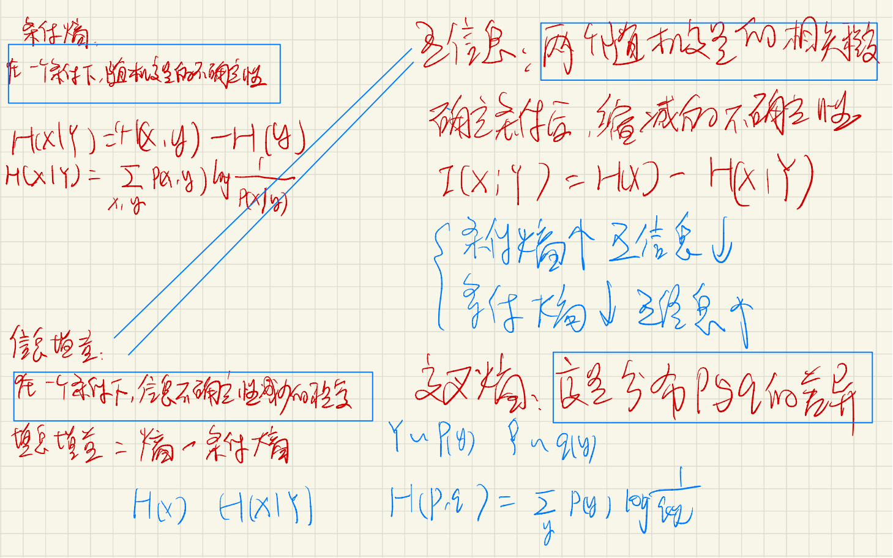

# 基本信息

- 学院：计算机学院
- 专业：计算机科学与技术
- 姓名：刘悦
- 学号：115
- 导师：刘新旺

## My work

#### Variational Auto-Encoding (VAE, 变分自编码器)

VAE和GAN (Generative Adversarial Network, 对抗生成网络) 的目标是基本一致的，

即模型希望构建一个从隐变量$Z$生成目标数据$X$的模型，都是属于生成式的模型

以数学的形式来说：

1. 首先假设隐变量$Z$服从某些常见的分布（先验分布），例如
   - 正态分布
   - 均匀分布
2. 训练一个模型$\hat X=g(Z)$
3. 使得该模型能够和原来的概率分布映射倒训练集的概率分布，目标是进行分布之间的变换

而生成式的模型的难题在于如何判断生成分布和真实分布的相似度，因为我们只知道两者采样的结果，而**不知道他们的分布表达式**

我们只有从先验分布中采样并通过模型得到的一批数据$\hat X$以及从真实数据中采样而来的一批数据$X$，但是我们并不知道他们的分布表达式，所以这里不能使用KL散度来刻画概率分布之间的差异。

但是VAE和GAN采用了不同的策略：

- GAN的思路是，无法找到适合的度量，我们就训练一个神经网络来代替这个度量，这个神经网络就被称为判别器。因此GAN不仅需要训练一个生成器也需要训练一个判别器，所以其训练过程较难，也有使用Wasserstein GAN (W-GAN)利用Wasserstein 距离的角度来对GAN优化的模型。
- 而VAE则采用了另外一种技巧，即根据样本获取分布，并且采用了贝叶斯公式

首先，我们进行问题定义，假设我们有一批数据样本$X_1,...,X_n$，整体用$X$来表示，我们希望利用$X1,..,X_n$得到$X$的分布$p(X)$，如果可以实现，那便是一个最理想的情况。

在VAE中采用的是另外一种形式，我们首先先利用条件概率公式对$p(X)$进行修改，
$$
p(X)=\int p(X|Z)p(Z)dz
$$
即利用一个$p(X|Z)$来描述由$Z$来生成$X$的模型，而对于$p(Z)$，我们假设$Z$服从标准正态分布$\N(0,1)$

但是，我们并不清楚经过重新采样出来的$Z_i$是否还对应着原来的$X_i$，所以我们直接最小化它们之间的距离是有问题的。

在VAE的模型中，我们没有使用先验分布是正态分布的假设，我们用的是假设$p(Z|X)$是正态分布：

即，给定一个真实样本$X_i$，我们假设存在一个**专属**于$X_i$的分布$p(Z|X_i)$，并且假设该分布是**正态分布**。

为什么？

如果我们假设$p(Z)$是正态分布，然后从$p(Z)$中采样一个$Z$，那么我们并不知道该$Z$对应哪个真实的$X$。而现在我们假设$P(Z|X_i)$是$X_i$的专属后验分布，则我们有理由说采样出来的$Z_i$应该要还原到$X_k$中去

因此，此时每一个$X_i$都分配上了一个专属的正态分布。但是这样的话，有多少个$X$就有多少个正态分布了，我们知道正态分布有两组参数

- 均值$\mu$
- 方差$\sigma^2$

那么，对于每个$X_i$，我们如何找出其专属正态分布$p(Z|X_i)$的均值和方差呢？

在这里，由于我们无法直接求出他的均值和方差，所以我们直接用神经网络来代替。

对于难算的一些东西，我们都倾向于利用神经网络来进行拟合，例如WGAN中的判别器。

于是，我们构建了两个神经网络$\mu_i=f_1(X_i)$，$log\sigma_i^2 = f_2(X_i)$来计算均值和方差，需要强调的是，这里我们选择拟合$\log\sigma^2_i$而不是直接$\sigma^2$是因为方差总是非负的，需要利用激活函数处理，而加上log后不需要激活函数，因为他们可正可负。

到此，我们已经知道专属的$X_i$的均值和方差了，也就是知道它的正态分布长什么样了，然后从这个专属分布中采样一个$Z_k$出来，然后经过一个生成器得到$\hat X_i=g(Z_k)$；这样我们就可以最小化$D(\hat X_i,X_i)$了，因为他们是一一对应的。

实际上，VAE就是为每个样本构造专属的正态分布，然后采样来重构

分表标准化的过程：

在重构的过程中会收到噪声的影响，**因为$Z_i$是通过重新采样过的，不是直接由encode计算得到的**。

显然噪声会增加重构的难度，但是这个噪声的强度是通过神经网络计算出来的，所以最终模型为了重构的更好，则肯定会想办法让方差为0。然后，方差为0后，就没有随机性了，所以不管如何采样其实都是只能得到确定的结果。

故，VAE还会让所有的后验分布$p(Z|X)$都逼近于标准正态分布，这样就

1. 防止了噪声为0的问题，因为标准正态分布的方差为1

2. 保证了模型的生成能力

   根据定义：$p(Z)=\sum_Xp(Z|X)P(X)=\sum_X \N(0,1)p(X)=\N(0,1)\sum_Xp(X)=\N(0,1)$

   所以$p(Z)$是标准正态分布。

那么，如何将后验分布$p(Z|X)$对齐$\N(0,1)$呢？

我们利用KL散度来进行逼近，将后验分布逼近于标准正态分布。

KL散度，又被称为相对熵，可以衡量两个概率密度之间的距离：

所以，原论文直接算了一般的正态分布与标准正态分布之间的KL散度

$KL(\N(\mu,\sigma^2)||\N(0,1))$作为额外的loss

该上式子展开可以得到：
$$
\mathcal{L}_{\mu,\sigma^2}=KL(\N(\mu,\sigma^2)||\N(0,1))=\int \frac{1}{\sqrt{2\pi}\sigma}e^{-\frac{(x-\mu)^2}{2\sigma^2}} log(\frac{e^{-(x-\mu)^2/2\sigma^2}/\sqrt{2\pi\sigma^2}}{e^{-x^2/2}/\sqrt{2\pi}})dx
\\
=\int \frac{1}{\sqrt{2\pi}\sigma}e^{-\frac{(x-\mu)^2}{2\sigma^2}} log(\frac{1}{\sigma}e^{\frac{1}{2}[x^2-(x-\mu)^2/\sigma^2]})dx
\\
=\frac{1}{2}\int \frac{1}{\sqrt{2\pi}\sigma}e^{-\frac{(x-\mu)^2}{2\sigma^2}} log(\frac{1}{\sigma^2}e^{x^2-(x-\mu)^2/\sigma^2})dx
\\
=\frac{1}{2}\int \frac{1}{\sqrt{2\pi}\sigma}e^{-\frac{(x-\mu)^2}{2\sigma^2}} (-log\sigma^2+{x^2-(x-\mu)^2/\sigma^2})dx
$$

以上的结果可以分为三项：

1. $-log\sigma^2$乘以概率密度的积分，结果为$-log\sigma^2$

2. 正态分布的二阶矩：

   $\mu^2+\sigma^2$

3. -1

故：
$$
\mathcal{L}_{\mu,\sigma^2}=KL(\N(\mu,\sigma^2)||\N(0,1))=\frac{1}{2}(-log\sigma^2+\mu^2+\sigma^2-1)
$$

重参数技巧：

如果我们需要从$p(Z|X_i)$中采样一个$Z_i$出来，尽管我们知道了$p(Z|X_i)$是一个正态分布，但是均值和方差都是依赖模型进行计算的，我们需要依赖这个过程反过来优化均值方差的模型，但是采样这个过程是不可导的。

所以我们将从$\N(\mu,\sigma^2)$中采样一个$Z$，相当于从$\N(0,1)$中采样一个$e$，然后让$Z=\mu+e\theta$

这样采样的过程就可以参与梯度下降了。

VAE的本质：

在VAE中，它的encoder有两个，一个用来算均值，一个用来算方差
VAE本质就是在常规的自编码器的基础上：

1. 对计算均值encoder的结果加上了高斯噪声，使得decoder对高斯噪声具有鲁棒性
2. KL loss，事实上就是encoder的正则项，希望encoder出来的东西均有0均值
3. 计算方差的encoder动态调节噪声的强度

训练的过程：

- 当 decoder 还没有训练好时（重构误差远大于 KL loss），就会适当降低噪声（KL loss 增加），使得拟合起来容易一些（重构误差开始下降）。
- 当 decoder 训练得还不错时（重构误差小于 KL loss），这时候噪声就会增加（KL loss 减少），使得拟合更加困难了（重构误差又开始增加），这时候 decoder 就要想办法提高它的生成能力

#### Variational Graph Auto-Encoding (VGAE, 图变分自编码器)

图变分自编码器的变分原理和做法和VAE一样，也是训练两个encoder，一个用于计算均值，一个用于计算方差。

- 用于计算均值的encoder，使得均值尽量接近于0
- 用于计算方差的encoder，使得噪声强度接近于1，给Z加入一些噪声
- decoder对X进行重构

其loss包括两个部分：

- 重构loss，用MSE均方差来计算
- KL散度，将后验概率$p(X|Z)$逼近于标准的正态分布$\N(0,1)$

但是于VAE不同的是，VGAE中的encoder和decoder不仅仅是简单的多层感知机（MLP），而是使用的图卷积。

图卷积：

图卷积操作可以类比于视觉中的卷积操作，都是对局部的信息进行采样。图卷积来源于图卷积神经网络。

给定一个具有 C 类节点的无向图 $G = \{V, E\}$，$V = \{v1, v2, ... . . , vN \} $和 E 分别是节点集和边集，其中 N 是节点数。 该图的特征在于其属性矩阵 $X \in R^{N×D}$ 和原始邻接矩阵$ A = (aij )^{N×N} $，其中 D 是节点属性的维度，如果 $(vi , vj ) \in E$，则 aij = 1，否则 aij = 0. 对应的度矩阵为 $D = diag(d1, d2, . . , dN ) \in R^{N×N }$且$ di = P (vi,vj )∈E aij$ 。 有了D，可以通过计算$D^{-1/2} (A + I)D^{-1/2}将原始邻接矩阵A归一化

图卷积通常包括三步：

- 变换
- 聚合
- 激活

#### 《Deep Fusion Clustering Network》

基于上述的VAE以及VGAE模型，并且结合了一种自动的融合机制以及三方聚类引导机制，我们组提出了一种新颖深度聚类的模型Deep Fusion Clustering Network (DFCN)。

