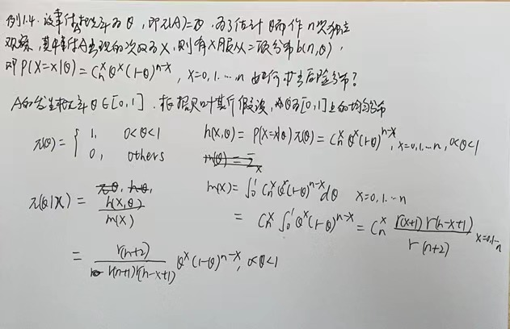
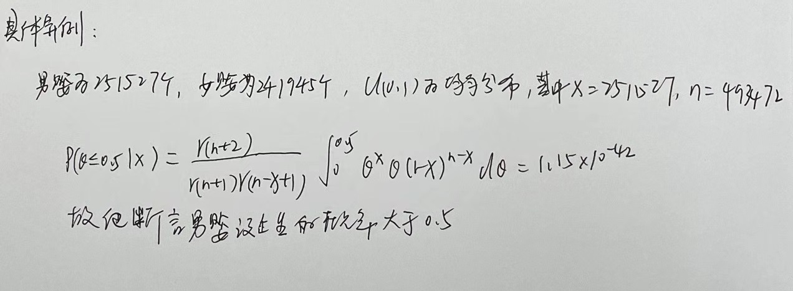
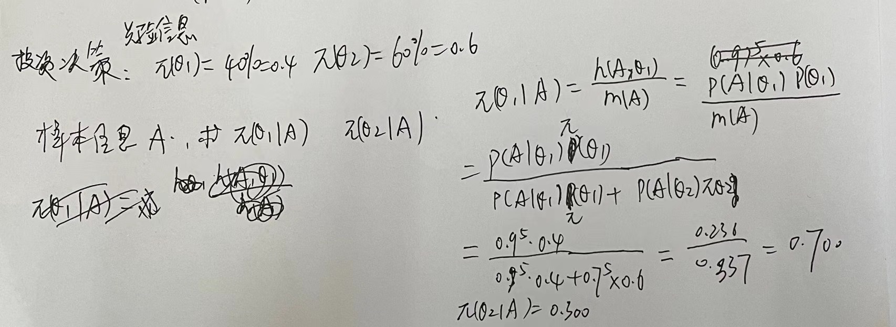
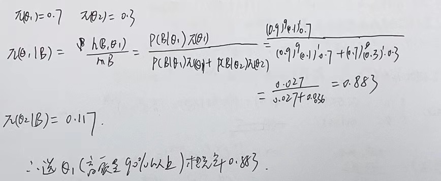
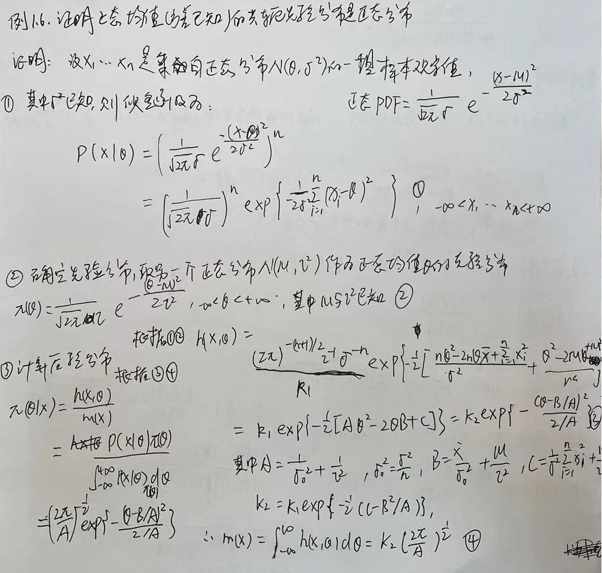
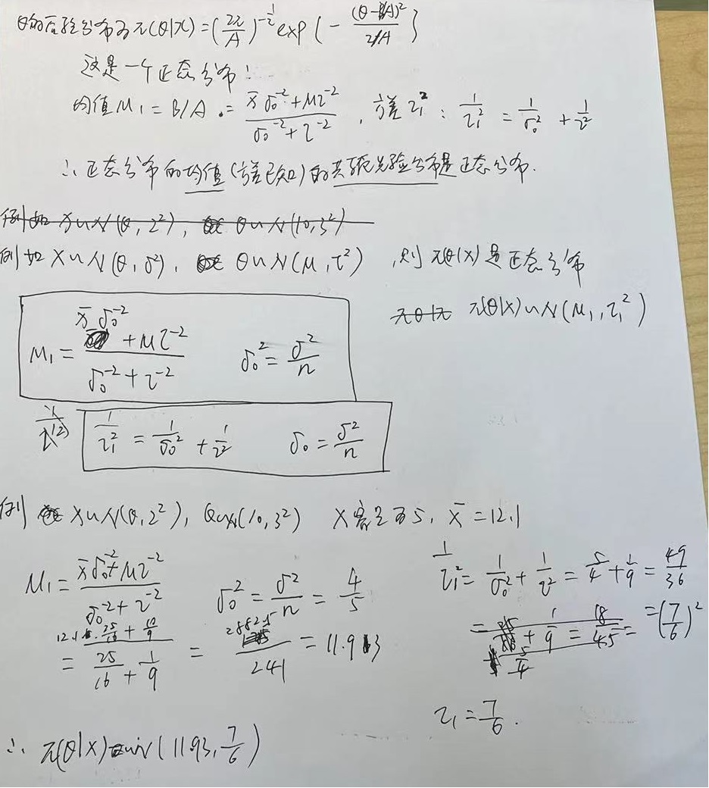
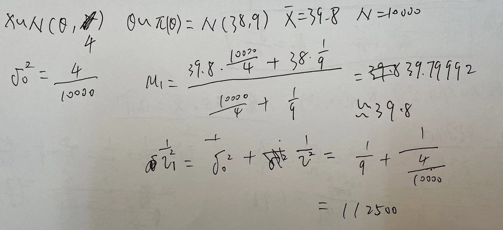
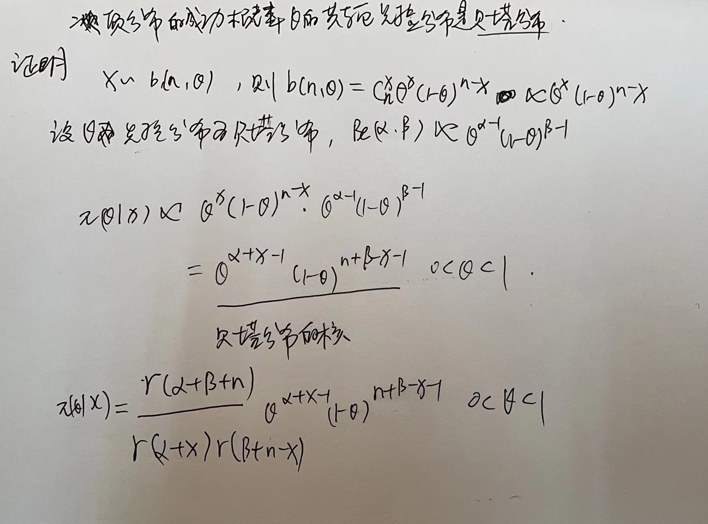
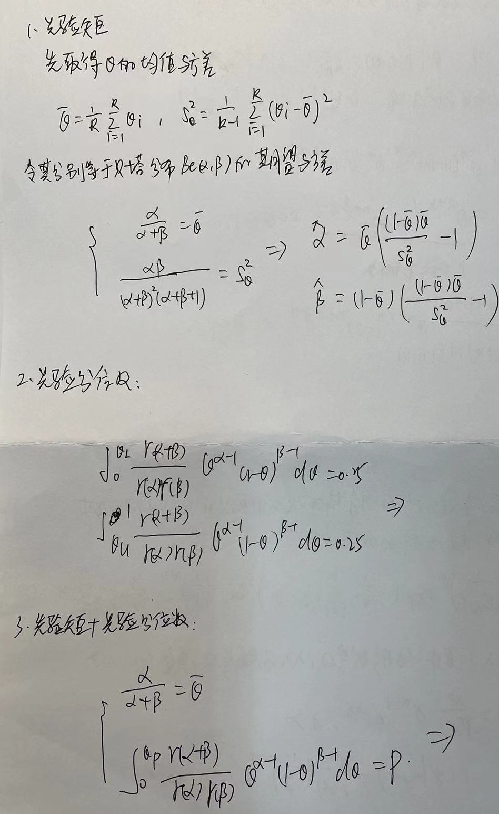

# 统计决策理论与贝叶斯分析

#### 引言

**两个学派：**

- 频率学派：

  建立在**测度轮**基础上的**公理化**体系

  基本观点：数据看成是一定概率分布的总体，研究对象是这个**总体**而不局限于数据本身

  依据：总体信息（模型）和样本信息（数据）

- 贝叶斯学派

  起源于贝叶斯的两项工作

  - 贝叶斯定理
  - 贝叶斯假设

  基本观点：任何一个未知量$\theta$都被看作为随机变量，应用一个概率分布去描述对$\theta$的未知情况。在抽样前就具有先验分布

  依据：总体信息（模型）和样本信息（数据）和先验信息

**两个学派之间的差异：**

1. 对概率的概念理解有差别：
   - 频率学派：坚持概率的频率解释
   - 贝叶斯学：派赞成主观概率
2. 统计推断理念的差异：
   - 频率学派：选定模型、确定统计量、决定统计量的分布
   - 贝叶斯学派：先验信息+样本信息->后验信息

**两个学派之间的批评：**

- 对贝叶斯学派的批评：
  1. 参数看成是随机变量是否妥当？
  2. 先验分布是否存在？如何选取？
- 对频率学派的批评：
  1. 问题的提法不妥当
  2. 判断统计方法好坏的标准不妥当

**贝叶斯假设：**

无信息先验分布（Non-informative Priors）应该选取在$\theta$**取值范围内的均匀分布**

**现代贝叶斯统计理论研究现状**

1. 先验分布理论的研究

   可以分为两类

   - 无信息先验分布

     一般采用取值范围内的均匀分布，贝叶斯假设

   - 共轭先验分布

     如果先验分布和似然函数可以使得先验分布和后验分布有相同的形式，则先验分布和似然函数是共轭的

     对于正太分布$N(\mu, \sigma^2)$而言，

     1. $\mu$已知，$\sigma$未知，$\sigma$的共轭分布族为逆伽马分布
     2. $\mu$未知，$\sigma$未知，参数的共轭分布族为正太-逆伽马分布

   

2. 后验分布的统计推断

   - 蒙特卡洛方法
   - 利用共轭先验分布的特性

#### 先验分布和后验分布

**统计推断中可用的三种信息**

1. 总体信息
2. 样本信息
3. 先验信息

**贝叶斯公式的三种形式**

1. 事件形式：

   $P(A_i|B) = \frac{P(A_i,B)}{P(B)}=\frac{P(B|A_i)P(A_i)}{\sum_{j=1}^kP(B|A_j)P(A_j)}$

2. 密度函数形式：

   - 先验分布$\pi(\theta)$
   - 后验分布$h(x_1, ...,x_n,\theta)=p(x_1,...,x_n|\theta)\pi(\theta)$

   $\pi(\theta|x_1,...x_n)=\frac{h(x_1,...,x_n,\theta)}{m(x_1,...,x_n)}=\frac{p(x_1,...,x_n|\theta)\pi(\theta)}{\int_{\Theta}{p(x_1,...,x_n|\theta)\pi(\theta)d\theta}}$

3. 离散形式：

   $\pi(\theta_i|x)=\frac{p(x|\theta_i)\pi(\theta_i)}{\sum_jp(x|\theta_j)\pi(\theta_j)}$

**后验分布是三种信息的综合**

**伽马分布和贝塔分布：**

- 伽马分布

  $\Gamma(s)=\int_0^{\infty}x^{s-1}e^{-x}dx,s>0$

  $\Gamma(s+1)=s\Gamma(s),\Gamma(n+1)=n!$

- 贝塔分布

  $\Beta(p,q)=\int_0^1x^{p-1}(1-x)^{q-1}dx,p>0,q>0$

  $\Beta(p,q)=\frac{\Gamma(p)\Gamma(q)}{\Gamma(p+q)}$

  $\beta_I(p,q)=\beta_e(p,q)=\frac{\Gamma(p+q)}{\Gamma(p)\Gamma(q)}\theta^{p-1}(1-\theta)^{q-1}$

  特例：

  1. $p=q=1$时，$\beta_I(1,1)$为区间[0, 1]上的均匀分布
  2. $p=q=1/2$时，$\beta_I(1/2,1/2)$为反余弦函数

**投资决策问题：**

为了提高某产品的质量，公司经理考虑增加投资来改进生产设备，预计需要投资90万元，但从投资效果来看，下属部门有两种意见：

- $\theta_1$：改进生成设备后，高质量产品可占比90%，可信度40%
- $\theta_2$：改进生成设备后，高质量产品可占比70%，可信度60%

加了一个实验A：试制了5个产品，全为高质量产品

又增加了一个实验B：试制了10个产品，9个高质量产品

问：如何决策

**共轭先验分布**

共轭先验分布式对某一分布中的参数而言的

$\theta$是总体分布的参数，$\pi(\theta)$是$\theta$是先验密度函数，假设由样本信息得到后验密度函数与$\pi(\theta)$具有相同的形式，则称$\pi(\theta)$是$\theta$的**共轭先验分布**

**正态均值的共轭先验分布是正态分布**

某一正态分布$\N(\theta,\sigma^2)$，其均值$\theta$服从一个正态分布$\pi(\theta)=\N(\mu, \tau)$（先验分布），则后验分布也服从一个正态分布$\pi(\theta|x)=\N(\mu_1, \tau_1)$

- $\mu_1 = \frac{\hat{x}\sigma_0^{-2}+\mu\tau^{-2}}{\sigma_0^{-2}+\tau^{-2}}$
- $\tau_1^{-2} = \sigma_0^{-2}+\tau^{-2}$
- $\sigma_0^2=\frac{\sigma^2}{n}$

 

例1.6：证明正态均值（方差已知）的共轭先验分布是正太分布

正态分布的PDF=$\frac{1}{\sqrt{2\pi}\sigma}e^{-\frac{(x-\theta)^2}{2\sigma^2}}$

补充例题：

设X表示人的胸围，根据经验，胸围是近似服从正态分布的。现测量了n=10000个人的胸围，得到样本均值为39.8cm，样本方差为4，假设$\theta$的先验分布为N(38,9)，求$\theta$的后验分布

**简化后验分布的计算**

省略常数因子

贝叶斯公式：$\pi(\theta|x)=\frac{h(x,\theta)}{m(x)} = \frac{p(x|\theta)\pi(\theta)}{m(x)}$

$m(x)$不依赖于$\theta$，作为常数因子，把他省略

$\pi(\theta|x) = p(x|\theta)\pi(\theta)$

右端为后验分布的核

简化例1.3的计算，得到后验分布的均值为B/A，方差为$A^{-1}$

**二项分布的成功概率$\theta$的共轭先验分布是贝塔分布**

$\pi(\theta|x) = \frac{\Gamma(\alpha+\beta+n)}{\Gamma(\alpha+x)\Gamma(\beta+n-x)}\theta^{\alpha+x-1}(1-\theta)^{\beta+n-x-1}$

证明：

**共轭先验分布的优缺点**

优点：

1. 计算方便

2. 后验分布的一些参数可以得到很好的解释：

   - 正态均值的共轭先验分布是正态分布

     - 均值

       $\sigma_0^{2} = \sigma^2/n$

       $\mu_1 = \frac{\hat x\sigma_0^{-2}+\mu \tau^{-2}}{\sigma_0^{-2}+\tau^{-2}}=\gamma \hat x+(1-\gamma)\mu$

       $\gamma$是用方差倒数组成的权

       **所以后验均值$\mu_1$是样本均值和先验均值的加权平均**

     - 方差

       $\frac{1}{\tau_1^2}=\frac{1}{\sigma_0^2}+\frac{1}{\tau^2}=\frac{n}{\sigma_0^2}+\frac{1}{\tau^2}$

       **后验分布的精度是样本均值分布的精度与先验分布精度之和**

       **增加样本量n或减少先验分布方差都有利于提高后验分布的精度**

   - 二项分布成功概率$\theta$的共轭先验分布是贝塔分布

     $\pi(\theta|x) = \frac{\Gamma(\alpha+\beta+n)}{\Gamma(\alpha+x)+\Gamma(\beta+n-x)}\theta^{\alpha+x-1}(1-\theta)^{\beta+n-x-1}$

     - 均值

        后验均值介于样本均值和先验均值之间

     - 方差

       样本增大，方差越来越小

缺点：如何找到合适的先验分布

**常用的一些共轭先验分布**

共轭先验分布选取的一般原则：

由似然函数$L(\theta)=p(x|\theta)$中所含的因式所决定的，即选与似然函数具有**相同核的分布**作为先验分布

例1.10

正态方差的共轭先验分布

为倒伽马分布

共轭先验分布

- 正态分布均值

  正态分布$N(\mu,\tau^2)$

  后验分布期望$\mu_1 = \frac{\hat x \sigma_0^2+\mu\tau^2}{\sigma_0^2+\tau^2}$

  后验分布的方差$\frac{1}{\tau_1^2} = \frac{1}{\sigma_0^2}+\frac{1}{\tau^2}$

- 正态分布方差

  倒伽马分布$IGa(a,b)$

- 二项分布成功的概率

  贝塔分布

  后验分布的期望$\frac{a+x}{a+b+n}$

- Poisson分布均值

  伽马分布

  $\frac{a+x}{b+1}$

- 指数分布均值的倒数

  伽马分布

**超参数及其确定**

先验分布中所含的未知参数被称为超参数

确定超参数的方法

1. 先验矩
2. 先验分位数
3. 先验矩和先验分位数
4. 其他方法

例1.4.1：

二项分布中成功概率$\theta$的共轭先验分布式贝塔分布$Be(\alpha, \beta)$，具有两个超参数

**多参数模型**

求某一个参数的后验分布的基本思想：

先根据先验信息给出参数的先验分布，然后按贝叶斯公式算得后验分布，即：

1. 总体的密度函数$p(x|\theta)$
2. 先验密度$\pi(\theta)$
3. $\pi(\theta|x)=p(x|\theta)\pi(\theta)$

但是有多个参数的情况？

**充分统计量**

- 充分性：**不损失信息的统计量**

- 定义：设$x=(x_1,...,x_n)$是来自于分布函数$F(x|\theta)$的一个样本，$T=T(x)$是统计量，假设在给定$T(x)=t$的条件下，$x$的条件分布与$\theta$无关的话，则称该统计量为$\theta$的充分统计量。

- 特性：当得到充分统计量T的某个取值t之后，**而失去原样本的观察值也没有关系**。

- 充要条件：

  因子分解定理

  存在一个t与$\theta$的函数$g(t,\theta)$和一个样本x的函数$h(x)$，使得对任一样本$x$和任意$\theta$，样本的联合密度$p(x|\theta)$可表示为它们的乘积，即$p(x|\theta)=g(T(x),\theta)h(x)$

  

  样本分布可以被拆开为两个因子的乘积：一个是和$\theta$无关仅和x有关；另一个是可以与$\theta$有关，但与x的关系仅仅通过充分统计量$T(x)$表现出来

**贝叶斯与充分统计量**

设$x=(x_1,...,x_n)$是来自于密度函数$p(x|\theta)$的一个样本，$T=T(x)$是统计量，它的密度函数为$p(t|\theta)$，又设$H={\pi(\theta)}$是它的某个先验分布族，则$T(x)$为$\theta$的充分统计量的充要条件是对任意一个先验分布，有

$\pi(\theta|T(x))=\pi(\theta|x)$

即用样本分布计算得到的后验分布和用统计量计算的后验分布相同的

**条件方法**

未知参数的后验分布：总体、样本和先验

条件方法的基本思想：基于后验分布的统计推断实际上只考虑了**已出现的数据**而**认为未出现的数据与推断无关**

和频率方法的区别：

频率采用的是对样本空间中所有可能出现的样本而求的

**贝叶斯估计**

后验密度$\pi(\theta|x)$

- 到达最大值$\theta_{MD}$：最大后验估计
- 中位数$\hat\theta_{Me}$：后验中位数估计
- 期望值：后验期望值估计

