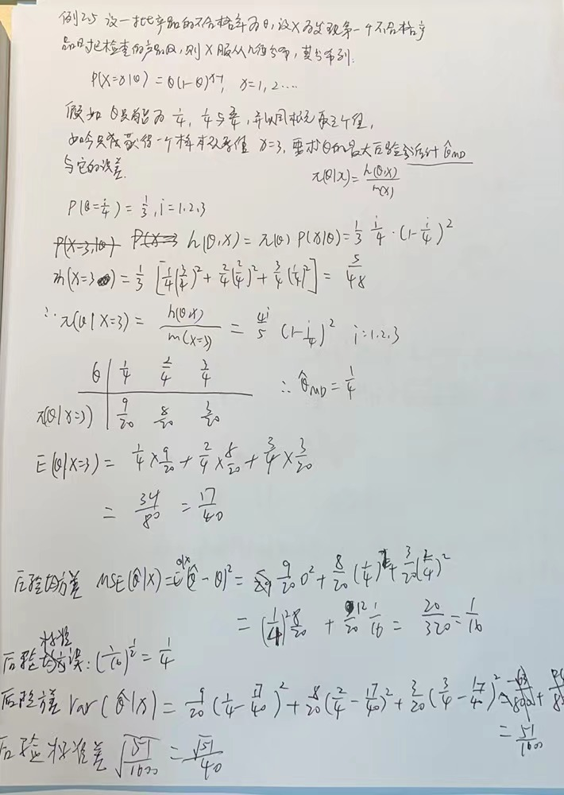

# 统计决策理论与贝叶斯分析学习报告

### 引言

**两个学派：**

- 频率学派：

  建立在**测度轮**基础上的**公理化**体系

  基本观点：数据看成是一定概率分布的总体，研究对象是这个**总体**而不局限于数据本身

  依据：总体信息（模型）和样本信息（数据）

- 贝叶斯学派

  起源于贝叶斯的两项工作

  - 贝叶斯定理
  - 贝叶斯假设

  基本观点：任何一个未知量$\theta$都被看作为随机变量，应用一个概率分布去描述对$\theta$的未知情况。在抽样前就具有先验分布

  依据：总体信息（模型）和样本信息（数据）和先验信息

**两个学派之间的差异：**

1. 对概率的概念理解有差别：
   - 频率学派：坚持概率的频率解释
   - 贝叶斯学：派赞成主观概率
2. 统计推断理念的差异：
   - 频率学派：选定模型、确定统计量、决定统计量的分布
   - 贝叶斯学派：先验信息+样本信息->后验信息
3. 采用的信息不同：
   - 频率学派：总体、样本
   - 贝叶斯学派：总体、样本、先验

**两个学派之间的批评：**

- 对贝叶斯学派的批评：
  1. 参数看成是随机变量是否妥当？
  2. 先验分布是否存在？如何选取？
- 对频率学派的批评：
  1. 问题的提法不妥当
  2. 判断统计方法好坏的标准不妥当

**贝叶斯假设：**

无信息先验分布（Non-informative Priors）应该选取在$\theta$**取值范围内的均匀分布**

**现代贝叶斯统计理论研究现状**

1. 先验分布理论的研究

   可以分为两类

   - 无信息先验分布

     一般采用取值范围内的均匀分布，贝叶斯假设

   - 共轭先验分布

     如果先验分布和似然函数可以使得先验分布和后验分布有相同的形式，则先验分布和似然函数是共轭的

     对于正太分布$N(\mu, \sigma^2)$而言，

     1. $\mu$已知，$\sigma$未知，$\sigma$的共轭分布族为逆伽马分布
     2. $\mu$未知，$\sigma$未知，参数的共轭分布族为正太-逆伽马分布

2. 后验分布的统计推断

   - 蒙特卡洛方法
   - 利用共轭先验分布的特性

### 先验分布和后验分布

**统计推断中可用的三种信息**

1. 总体信息
2. 样本信息
3. 先验信息

**贝叶斯公式的三种形式**

1. 事件形式：

   $P(A_i|B) = \frac{P(A_i,B)}{P(B)}=\frac{P(B|A_i)P(A_i)}{\sum_{j=1}^kP(B|A_j)P(A_j)}$

2. 密度函数形式：

   - 先验分布$\pi(\theta)$
   - 后验分布$h(x_1, ...,x_n,\theta)=p(x_1,...,x_n|\theta)\pi(\theta)$

   $\pi(\theta|x_1,...x_n)=\frac{h(x_1,...,x_n,\theta)}{m(x_1,...,x_n)}=\frac{p(x_1,...,x_n|\theta)\pi(\theta)}{\int_{\Theta}{p(x_1,...,x_n|\theta)\pi(\theta)d\theta}}$

3. 离散形式：

   $\pi(\theta_i|x)=\frac{p(x|\theta_i)\pi(\theta_i)}{\sum_jp(x|\theta_j)\pi(\theta_j)}$

**后验分布是三种信息的综合**

**伽马分布和贝塔分布：**

- 伽马分布

  $\Gamma(s)=\int_0^{\infty}x^{s-1}e^{-x}dx,s>0$

  $\Gamma(s+1)=s\Gamma(s),\Gamma(n+1)=n!$

- 贝塔分布

  $\Beta(p,q)=\int_0^1x^{p-1}(1-x)^{q-1}dx,p>0,q>0$

  $\Beta(p,q)=\frac{\Gamma(p)\Gamma(q)}{\Gamma(p+q)}$

  $\beta_I(p,q)=\beta_e(p,q)=\frac{\Gamma(p+q)}{\Gamma(p)\Gamma(q)}\theta^{p-1}(1-\theta)^{q-1}$

  特例：

  1. $p=q=1$时，$\beta_I(1,1)$为区间[0, 1]上的均匀分布
  2. $p=q=1/2$时，$\beta_I(1/2,1/2)$为反余弦函数

**投资决策问题：**

为了提高某产品的质量，公司经理考虑增加投资来改进生产设备，预计需要投资90万元，但从投资效果来看，下属部门有两种意见：

- $\theta_1$：改进生成设备后，高质量产品可占比90%，可信度40%
- $\theta_2$：改进生成设备后，高质量产品可占比70%，可信度60%

加了一个实验A：试制了5个产品，全为高质量产品

又增加了一个实验B：试制了10个产品，9个高质量产品

问：如何决策

**共轭先验分布**

共轭先验分布式对某一分布中的参数而言的

$\theta$是总体分布的参数，$\pi(\theta)$是$\theta$是先验密度函数，假设由样本信息得到后验密度函数与$\pi(\theta)$具有相同的形式，则称$\pi(\theta)$是$\theta$的**共轭先验分布**

**正态均值的共轭先验分布是正态分布**

某一正态分布$\N(\theta,\sigma^2)$，其均值$\theta$服从一个正态分布$\pi(\theta)=\N(\mu, \tau)$（先验分布），则后验分布也服从一个正态分布$\pi(\theta|x)=\N(\mu_1, \tau_1)$

- $\mu_1 = \frac{\hat{x}\sigma_0^{-2}+\mu\tau^{-2}}{\sigma_0^{-2}+\tau^{-2}}$
- $\tau_1^{-2} = \sigma_0^{-2}+\tau^{-2}$
- $\sigma_0^2=\frac{\sigma^2}{n}$

 

例1.6：证明正态均值（方差已知）的共轭先验分布是正太分布

正态分布的PDF=$\frac{1}{\sqrt{2\pi}\sigma}e^{-\frac{(x-\theta)^2}{2\sigma^2}}$

补充例题：

设X表示人的胸围，根据经验，胸围是近似服从正态分布的。现测量了n=10000个人的胸围，得到样本均值为39.8cm，样本方差为4，假设$\theta$的先验分布为N(38,9)，求$\theta$的后验分布

**简化后验分布的计算**

省略常数因子

贝叶斯公式：$\pi(\theta|x)=\frac{h(x,\theta)}{m(x)} = \frac{p(x|\theta)\pi(\theta)}{m(x)}$

$m(x)$不依赖于$\theta$，作为常数因子，把他省略

$\pi(\theta|x) = p(x|\theta)\pi(\theta)$

右端为后验分布的核

简化例1.3的计算，得到后验分布的均值为B/A，方差为$A^{-1}$

**二项分布的成功概率$\theta$的共轭先验分布是贝塔分布**

$\pi(\theta|x) = \frac{\Gamma(\alpha+\beta+n)}{\Gamma(\alpha+x)\Gamma(\beta+n-x)}\theta^{\alpha+x-1}(1-\theta)^{\beta+n-x-1}$

证明：

**共轭先验分布的优缺点**

优点：

1. 计算方便

2. 后验分布的一些参数可以得到很好的解释：

   - 正态均值的共轭先验分布是正态分布

     - 均值

       $\sigma_0^{2} = \sigma^2/n$

       $\mu_1 = \frac{\hat x\sigma_0^{-2}+\mu \tau^{-2}}{\sigma_0^{-2}+\tau^{-2}}=\gamma \hat x+(1-\gamma)\mu$

       $\gamma$是用方差倒数组成的权

       **所以后验均值$\mu_1$是样本均值和先验均值的加权平均**

     - 方差

       $\frac{1}{\tau_1^2}=\frac{1}{\sigma_0^2}+\frac{1}{\tau^2}=\frac{n}{\sigma_0^2}+\frac{1}{\tau^2}$

       **后验分布的精度是样本均值分布的精度与先验分布精度之和**

       **增加样本量n或减少先验分布方差都有利于提高后验分布的精度**

   - 二项分布成功概率$\theta$的共轭先验分布是贝塔分布

     $\pi(\theta|x) = \frac{\Gamma(\alpha+\beta+n)}{\Gamma(\alpha+x)+\Gamma(\beta+n-x)}\theta^{\alpha+x-1}(1-\theta)^{\beta+n-x-1}$

     - 均值

        后验均值介于样本均值和先验均值之间

     - 方差

       样本增大，方差越来越小

缺点：如何找到合适的先验分布

**常用的一些共轭先验分布**

共轭先验分布选取的一般原则：

由似然函数$L(\theta)=p(x|\theta)$中所含的因式所决定的，即选与似然函数具有**相同核的分布**作为先验分布

例1.10

正态方差的共轭先验分布

为倒伽马分布

共轭先验分布

- 正态分布均值

  正态分布$N(\mu,\tau^2)$

  后验分布期望$\mu_1 = \frac{\hat x \sigma_0^2+\mu\tau^2}{\sigma_0^2+\tau^2}$

  后验分布的方差$\frac{1}{\tau_1^2} = \frac{1}{\sigma_0^2}+\frac{1}{\tau^2}$

- 正态分布方差

  倒伽马分布$IGa(a,b)$

- 二项分布成功的概率

  贝塔分布

  后验分布的期望$\frac{a+x}{a+b+n}$

- Poisson分布均值

  伽马分布

  $\frac{a+x}{b+1}$

- 指数分布均值的倒数

  伽马分布

**超参数及其确定**

先验分布中所含的未知参数被称为超参数

确定超参数的方法

1. 先验矩
2. 先验分位数
3. 先验矩和先验分位数
4. 其他方法

例1.4.1：

二项分布中成功概率$\theta$的共轭先验分布式贝塔分布$Be(\alpha, \beta)$，具有两个超参数

**多参数模型**

求某一个参数的后验分布的基本思想：

先根据先验信息给出参数的先验分布，然后按贝叶斯公式算得后验分布，即：

1. 总体的密度函数$p(x|\theta)$
2. 先验密度$\pi(\theta)$
3. $\pi(\theta|x)=p(x|\theta)\pi(\theta)$

但是有多个参数的情况？

**充分统计量**

- 充分性：**不损失信息的统计量**

- 定义：设$x=(x_1,...,x_n)$是来自于分布函数$F(x|\theta)$的一个样本，$T=T(x)$是统计量，假设在给定$T(x)=t$的条件下，$x$的条件分布与$\theta$无关的话，则称该统计量为$\theta$的充分统计量。

- 特性：当得到充分统计量T的某个取值t之后，**而失去原样本的观察值也没有关系**。

- 充要条件：

  因子分解定理

  存在一个t与$\theta$的函数$g(t,\theta)$和一个样本x的函数$h(x)$，使得对任一样本$x$和任意$\theta$，样本的联合密度$p(x|\theta)$可表示为它们的乘积，即$p(x|\theta)=g(T(x),\theta)h(x)$

  

  样本分布可以被拆开为两个因子的乘积：一个是和$\theta$无关仅和x有关；另一个是可以与$\theta$有关，但与x的关系仅仅通过充分统计量$T(x)$表现出来

**贝叶斯与充分统计量**

设$x=(x_1,...,x_n)$是来自于密度函数$p(x|\theta)$的一个样本，$T=T(x)$是统计量，它的密度函数为$p(t|\theta)$，又设$H={\pi(\theta)}$是它的某个先验分布族，则$T(x)$为$\theta$的充分统计量的充要条件是对任意一个先验分布，有

$\pi(\theta|T(x))=\pi(\theta|x)$

即用样本分布计算得到的后验分布和用统计量计算的后验分布相同的

### 贝叶斯推断

**条件方法**

未知参数的后验分布：总体、样本和先验

条件方法的基本思想：基于后验分布的统计推断实际上只考虑了**已出现的数据**而**认为未出现的数据与推断无关**

和频率方法的区别：

频率采用的是对样本空间中所有可能出现的样本而求的

**贝叶斯估计**

后验密度$\pi(\theta|x)$

- 到达最大值$\theta_{MD}$：最大后验估计
- 中位数$\hat\theta_{Me}$：后验中位数估计
- 期望值：后验期望值估计

这三个估计都称为贝叶斯估计$\hat \theta_B$

例2.2：

例2.3：

在二项分布的情况下：

1. $\theta$的最大后验估计就是经典统计中的极大似然估计，即$\theta$的极大似然估计就是取特定的先验分布$U(0,1)$下的贝叶斯估计
2. 后验期望估计$\hat \theta_E$要比最大后验估计$\hat \theta_{MD}$更适合一些，一般采用后验期望估计作为贝叶斯估计

例2.4：

**贝叶斯估计的误差**

设$\hat \theta$是$\theta$的一个贝叶斯估计，在样本给定后，$\hat \theta$是一个数，评价贝叶斯估计的最好而又简单的方式是用$\theta$对$\hat \theta$的后验方差或者平方根来度量。

定义：

设参数$\theta$的后验分布为$\pi(\theta|x)$，贝叶斯估计为$\hat \theta$，则$\hat \theta$的**后验均方误差**为：
$$
MSE(\hat \theta|x) = E^{\theta|x}(\theta-\hat \theta)^2
$$

其平方根为**后验标准误**

其中：

1. $E^{\theta|x}$表示用条件分布$\pi(\theta|x)$求期望
2. 当$\hat \theta=\hat \theta_E=E(\theta|x)$时，则$MSE(\hat \theta_E|x)=E^{\theta|x}(\theta-\hat \theta_E)^2=Var(\theta|x)$，被称为**后验方差**，其平方根为**后验标准差**

**后验均方差，后验标准误 vs 后验方差，后验标准差**：

例2.5：

**区间估计（可信区间）**

定义：

参数$\theta$的后验分布为$\pi(\theta|x)$，对给定的样本x和概率$1-\alpha$，若存在这样的两个统计量$\hat \theta_L=\hat \theta_L(x)$与$\hat \theta_U=\hat \theta_U(x)$使得$P(\hat \theta_L\le\theta\le \hat\theta_U|x)\ge1-\alpha$

则称该区间为参数$\theta$的可信水平为$1-\alpha$贝叶斯可信区间。

例2.8:

1. 确定参数的先验分布：倒伽马分布
2. 利用历史资料确定两个超参数$\alpha$$\beta$
3. 求出后验分布
4. 用后验均值作为$\theta$的贝叶斯估计
5. 可信下限的确定

**最大后验密度（HPD）可信区间**

设参数$\theta$的后验密度$\pi(\theta|x)$，对给定的概率$1-\alpha$，若在直线上存在这样的一个子集C，满足

1. $p(C|x)=1-\alpha$
2. 在C中的后验概率最大，则称C是最大后验密度可信集

当后验密度函数$\pi(\theta|x)$是$\theta$的单峰连续函数时，获得$\theta$的$1-\alpha$HPD可信区间的数值计算方法：

1. 对给定的k，建立方程

   $\pi(\theta|x) = k$，得解$\theta_1(k)$和$\theta_2(k)$

   $C(k)=[\theta_1(k), \theta_2(k)]$

2. 计算概率

   $p(\theta\in C(k)|x) = \int_{C(l)}\pi(\theta|x)d\theta$

3. 若给定的k，使其p为$1-\alpha$，则$C(k)$即为所求的HPD可信区间

**假设检验**

经典统计中处理假设检验问题的基本步骤：

1. 建立原假设$H_0$与备择假设$H_1$
2. 选择检验统计量$T=T(x)$，使其在原假设$H_0$为真的时候概率分布已知
3. 对给定的显著性水平$\alpha$，确定拒绝域W，使其犯第一类错误，弃真错误的概率不超过$\alpha$
4. 当样本观察值落入W，则拒绝原假设

贝叶斯统计中处理假设检验问题的基本思想：

获得后验分布$\pi(\theta|x)$后，先计算两个假设的后验概率，即

$\alpha_i=P(\theta|x)$

比较两者的大小

- 当后验概率比（或称后验机会比）$\alpha_0/\alpha_1>1$时接受$H_0$
- 当$\alpha_0/\alpha_1<1$时接受$H_1$
- 其他不宜判断

贝叶斯假设检验更容易简单：

1. 无需选择检验统计量，确定抽样分布
2. 无需事先给出显著性水平，确定其拒绝域
3. 易推广倒多重假设检验的场合

例2.10：

**贝叶斯因子**

定义：

设两个假设$\Theta_1$和$\Theta_2$的先验概率分别为$\pi_0$与$\pi_1$，后验概略分别为$\alpha_0$与$\alpha_1$，则称：

$B^{\pi}(x)=\frac{后验机会比}{先验机会比}=\frac{\alpha_0/\alpha_1}{\pi_0/\pi_1}$

为贝叶斯因子

表示数据x支持原假设的程度

- 后验机会比=$\alpha_0/\alpha_1$
- 先验机会比=$\pi_0/\pi_1$

**简单假设对简单假设**

此时，**不依赖于先验分布，只是简单的似然比**：
$$
B^{\pi}(x) = \frac{p(x|\theta_0)}{p(x|\theta_1)}
$$

例题2.11

**复杂假设对复杂假设**

此时，**不依赖于先验分布，只是简单的似然比**：
$$
B^{\pi}(x) = \frac{p(x|\theta_0)}{p(x|\theta_1)}
$$

### 先验分布的确定

**主观概率**

贝叶斯学派需要研究的问题：如何利用经验和过去的历史资料确定概率和先验分布

经典统计确定概率的两种方法：

1. 古典方法
2. 频率方法

主观概率：一个时间的概率是人们根据经验对该事件发生可能性所给出的个人信念

确定主观概率的方法

1. 利用对立事件的比较确定主观概率
2. 利用专家意见确定主观概率
3. 向多位专家咨询确定主观概率
4. 充分利用历史资料，考虑现有信息加以修正

概率的三条公理

1. 非负性公理：对任意事件A，$0\le P(A)\le1$
2. 正则性公理：必然事件的概率为1
3. 可列可加性公理

**利用先验信息确定先验分布**

- 离散型

  主观概率的方法

- 连续型

  1. 直方图法
  2. 选定先验密度函数形式再估计其超参数
  3. 定分度法与变分度法

**直方图法**

1. 把参数空间分成一些小区间
2. 在每个小区间上决定主观概率或依据历史数据确定其频率
3. 绘制频率直方图
4. 在直方图上做一条光滑曲线，此曲线即为先验分布$\pi(\theta)$

**选定先验密度函数形式再估计其超参数**

1. 根据先验信息选定$\theta$的先验密度函数$\pi(\theta)$的形式，如选其共轭先验分布
2. 当先验分布中含有未知参数（超参数）时，给出超参数的估计值，使$\pi(\theta;\hat \alpha,\hat \beta)$最接近于先验信息

**定分度法和变分度法**

1. 定分度法

   把参数可能取值的区间逐次分为长度相等的小区间，每次在每个小区间上请专家给出主观概率

2. 变分度法

   把参数可能取值的区间逐次分为机会相等的两个小区间，这里的分点由专家确定

**利用边缘分布m(x)确定先验密度**

1. 边缘分布
2. 混合分布
3. 先验选择的ML-II方法
4. 先验选择的矩方法

**无信息先验分布**

1. 贝叶斯假设

   无信息先验分布应该选取在定义域的均匀分布

   问题：

   1. 当$\theta$取值范围为无限区间，就无法定义正常的均匀分布
   2. 不满足变换下的不变性

2. 位置-尺度参数族的信息先验

### 决策中的收益、损失与效用

**决策**

决策是对一件事作决定，它与推断的差别在于是否涉及后果

贝叶斯决策：把损失函数加入贝叶斯推断就形成贝叶斯决策，损失函数被称为贝叶斯中的**第四种信息**

**决策问题的三要素**

1. 状态集
2. 行动集
3. 收益函数

**决策准则**

行动的容许性

决策准则

1. 乐观准则
2. 悲观准则
3. 折中准则

**乐观准则**

1. 确定各个可行方案
2. 确定决策问题将面临的各种自然状态
3. 将各种方案在各个自然状态下的收益列于决策矩阵表中
4. 求每一个方案在各自状态下的最大收益值，将其填在决策矩阵表的最后一列
5. 取最大值形成最佳决策方案$max_{a_i}\{ max_{\theta_j[Q_{ij}]}\}$

**悲观准则**

$max_{a_i}\{ min_{\theta_j[Q_{ij}]}\}$

**折中准则**

又称$\alpha$系数决策准则

完全乐观，$\alpha=1$

完全悲观，$\alpha=0$

步骤：

1. 确定$\alpha$

2. 对每一行动a计算

   $H(a)=\alpha max(Q(\theta,a))+(1-\alpha)min(Q(\theta,a))$

3. 取行动，使其最大

例：

**先验期望准则**

定义：

对给定的决策问题，若在状态集$\Theta$上有一个正常的先验分布$\pi(\theta)$

则收益函数$Q(\theta, a)$对于$\pi(\theta)$的期望和方差
$$
\hat Q(a)=E^{\theta}[Q(\theta,a)]
\\
Var[Q(\theta, a)]=E^{\theta}[Q(\theta,a)]^2-[E^{\theta}Q(\theta,a)]^2
$$
分别称为**先验期望的收益**和**收益的先验方差**，

使得先验期望收益到达最大收益的行动被称为**最优行动**

最优行动不止一个，其中先验方差到达最小的行动被称为**二阶矩准则下的最优行动**

**两个性质**

1. 在先验分布不变的情况下，收益函数的**正系数线性变换**不会改变先验期望准则下的最优行动
2. 收益函数加上常数，先验分布不变，则最优行动不变

**损失函数**

损失：该赚而没有赚到的钱

损失矩阵：

1. 选出最优决策
2. 看看其他决策与最优决策之间的差值

$L(\theta,a)=max(Q(\theta,a))-Q(\theta,a)$

损失函数下的悲观准则：

1. 先选损失最大的
2. 再选损失最小的

例：

用损失函数做决策要比用收益函数做决策更合理

损失函数下的先验期望准则：

利用损失函数来算最优行动和二阶矩准则下的最优行动

**常用的损失函数**

1. 平方损失函数，用得最多

   $L(\theta, a) = (a-\theta)^2$

2. 线性损失函数

   $L(\theta,a)=k_0(\theta-a)，a\le \theta$

   $L(\theta,a)=k_1(a-\theta), a\ge\theta$

3. 0-1损失函数

   $L(\theta,a)=0,|\theta-a|\le \alpha$

   $L(\theta,a)=1,|\theta-a|\ge\alpha$

4. 多元二次损失函数

   $L(\theta,a)=\sum_{i=1}^P\omega_i(a_i-\theta_i)^2$

### 贝叶斯决策

**决策问题分类**

1. 仅使用先验信息的决策问题：**无数据的决策问题**
2. 仅使用抽样信息的决策问题：**统计决策问题**
3. 先验信息和抽样信息都使用的决策问题：**贝叶斯决策问题**

**贝叶斯决策问题**

1. 似然函数$X$~$p(x|\theta),\theta\in\Theta$
2. 先验分布$\theta$~$\pi(\theta)$
3. 行动集$A=\{a\}$
4. 损失函数$L(\theta,a)$

贝叶斯决策的优缺点：

- 优点：
  1. 充分利用各种信息，决策结果更加科学化
  2. 对调查结果的可能性加以数量化评价
  3. 巧妙将结果和先验知识结合
  4. 可以不断使用，使得结果逐步完善
- 缺点：
  1. 所需要的数据多，分析计算复杂，如果解决的问题比较复杂时，矛盾突出
  2. 有些数据需要使用主观概率

**后验风险决策**

损失函数$L(\theta,a)$对后验分布$\pi(\theta|x)$的期望称为后验风险，记$R(a|x)$
$$
R(a|x) =E^{\theta|x}[L(\theta,a)]=\sum_iL(\theta,a)\pi(\theta_i|x)
$$

$$
R(a|x) =E^{\theta|x}[L(\theta,a)]=\int_{\Theta} L(\theta,a)\pi(\theta_i|x)d\theta
$$

用后验分布计算的平均损失

**决策函数**

从样本空间X到行动集A上的一个映射称为决策函数。决策函数组成的类是决策函数类D

**后验风险准则**

在给定的贝叶斯决策问题中，$D=\{\delta(x)\}$是其决策函数类，则称
$$
R(\delta|x) = E^{\theta|x}[L(\theta,\delta(x)))]=\sum_iL(\theta,a)\pi(\theta_i|x)=\int_{\Theta} L(\theta,a)\pi(\theta_i|x)d\theta
$$
为决策函数$\delta=\delta(x)$的后验风险，假如在决策函数类中存在这样的决策函数$\delta'=\delta'(x)$，它具有最小的风险
$$
R(\delta'|x) = min(R(\delta|x))
$$
则称之为后验风险准则下的最优决策，贝叶斯决策、贝叶斯解，贝叶斯估计。

**求解贝叶斯估计**

例：

1. 求后验分布
2. 求后验风险函数
3. 使得风险函数到达最小时的决策函数

**如果判断一个样本是来自密度函数为$p_0(x)$的总体还是来自于$p_1(x)$的总体**

两个假设，$H_0$：x来自于$p_0(x)$。$H_1$：x来自于$p_1(x)$

1. 假设检验问题转换为贝叶斯决策问题：
   - 参数空间
   - 行动空间
   - 先验分布
   - 损失函数
2. 求后验分布
3. 计算每个行动下的后验风险
4. 找出最佳行动，即确定拒绝域

**常用损失函数下的贝叶斯估计**

1. 平方损失函数下的贝叶斯估计

   - 在平方损失函数$L(\theta,\delta)=(\delta-\theta)^2$下，$\theta$的贝叶斯估计为后验均值，即
     $$
     \delta_B(x) = E(\theta|x)
     $$

   - 在加权平方损失函数$L(\theta,\delta)=\lambda(\theta)(\delta-\theta)^2$下，$\theta$的贝叶斯估计为
     $$
     \delta_B(x) =\frac{E[\lambda(\theta)\theta|x]}{E[\lambda(\theta)|x]}
     $$

   例：

2. 线性损失函数下的贝叶斯估计

   

